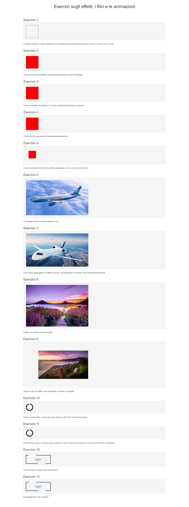

# Html-css-animation-filter
This is an exercise about effects, filters and animations made with HTML and CSS.

### [Live Version](https://gianluigivitale.github.io/html-css-animation-filter/)

_Preview:_

